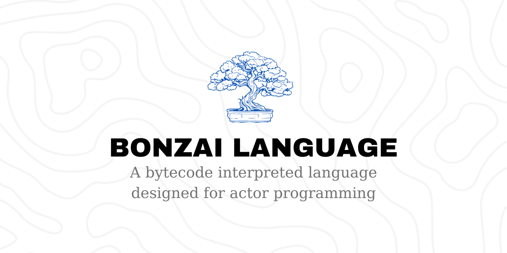

[](https://github.com/thomasvergne/bonzai/issues)



## Introduction

Bonzai is a programming language that relies on [Actor model](https://en.wikipedia.org/wiki/Actor_model), [Reactive programming](https://en.wikipedia.org/wiki/Reactive_programming) and on a strong and non-taulerant typechecker to guarantee types and computations in your code. It compiles down to a custom bytecode with relatively good performance.

## Table of Contents

1. [Features](#features)
2. [Example Code](#example-code)
3. [Building Bonzai](#building-bonzai)
4. [Contributing](/CONTRIBUTING.md)
5. [Reporting Issues](#reporting-issues)

---

## Features

- **Strong typechecker**: Throw errors for incompatible types, to ensure security when running your code.
- **Actors as expressions**: Make use of first-class actors to express every code you want to.
- **Reactive variables**: described as *live* variables, they are updated in real-time.
- **Bytecode compilation**: Suitable for Unix-like systems, enabling almost multi-platform code running.

## Example Code

A parallel HTTP server dispatcher example :

```v
require "std:http"
require "std:natives"
require "std:tuple"

createParallelHTTP(10, fn(req, id) => {
  print("Received request on $id")
  req.respondText("text/html", "<h1>Hello, world!</h1>")
})

print("Server running on port http://localhost:8000")
```

## Building Bonzai

### Prerequisites
- **Haskell compiler**: GHC 2021 is required to compile the code
- **XMake**: to compile the VM
- **Python**: to run the build script

1. **Clone the Repository**: 
  ```sh
  git clone https://github.com/thomasvergne/bonzai.git
  cd bonzai
  ```
2. **Build the project**:
  ```sh
  python3 scripts/build.py
  ```
3. **Set the environment variable**:
  ```sh
  export BONZAI_PATH="/path/to/bonzai"
  export PATH="/path/to/bonzai/bin:$PATH"
  ```

### Reporting Issues

If you find any issues or have suggestions, please use the [Issues page](https://github.com/thomasvergne/bonzai/issues). We appreciate your feedback and contributions!
